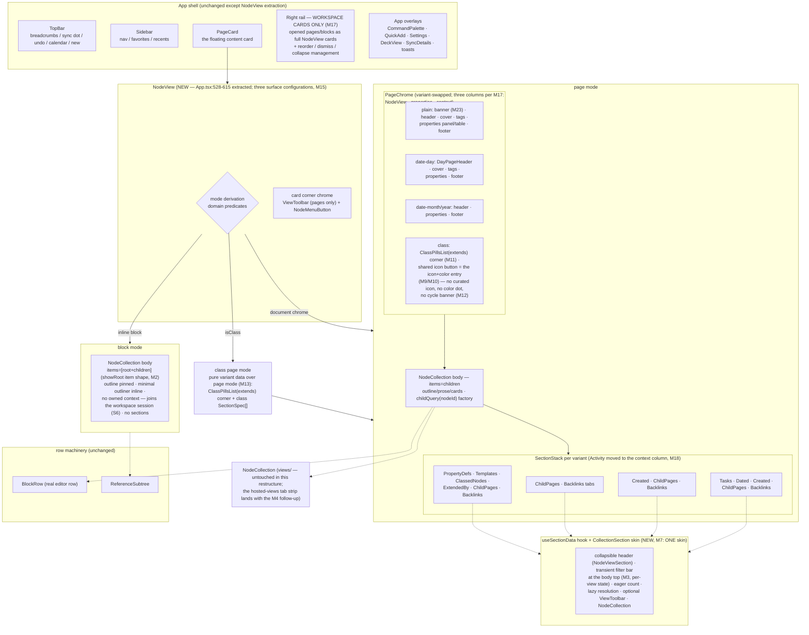
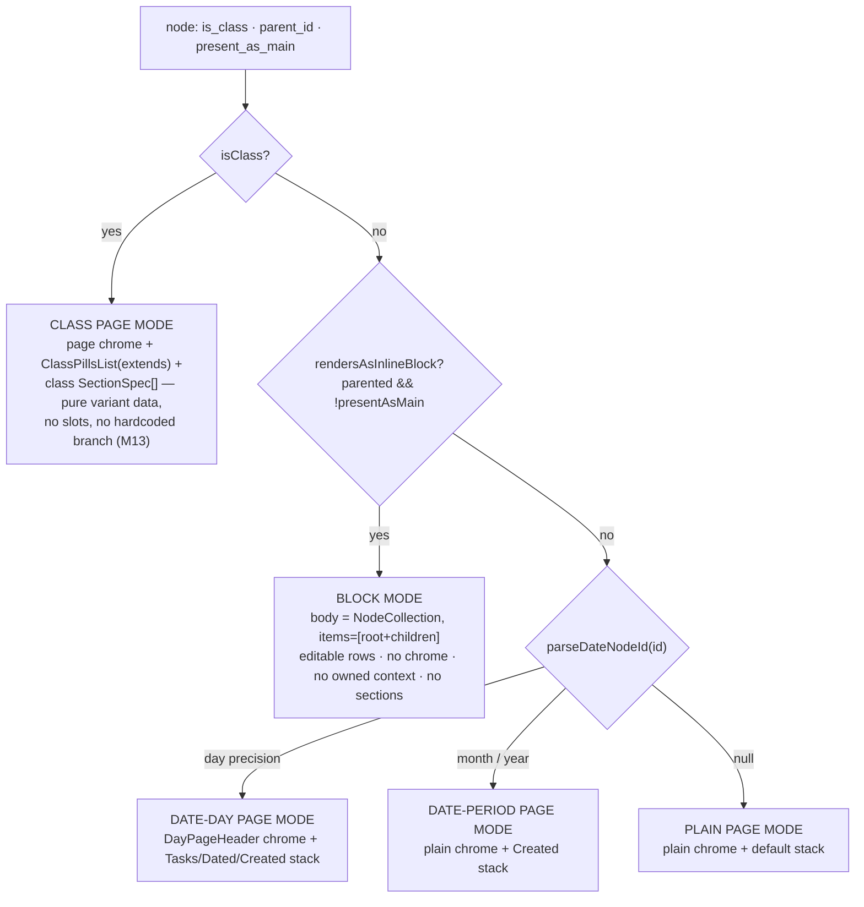
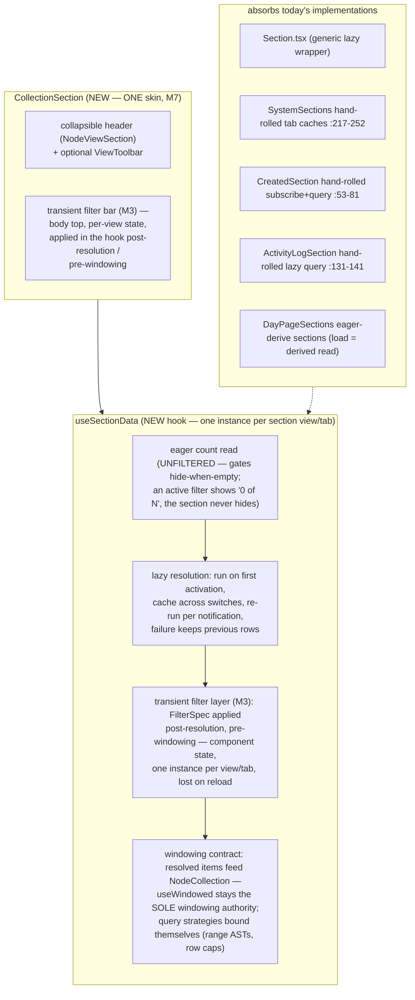
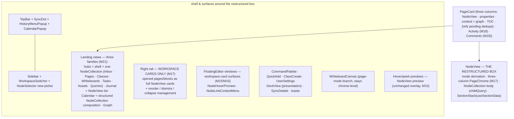

# Main-content restructure — NodeView shell · PageChrome · NodeCollection body · lazy-section contract

Status: **PROPOSAL (2026-10-06), amended through owner pass 12** — distilled
from the owner–agent design conversation of 2026-10-06. Not scheduled, not
implemented (S1 has owner go; D1 pinned). Sits on top of the uncommitted
Capacities-style layout work in the working tree (`PageView layout prop`,
`DayPageHeader`, `CreatedSection`, the backlinks tab strip). No
wire/protocol change — pure web view-layer, like `05`.

**Revision log — owner pass 1 (same day):**
1. *NodeView must not become the new god object* — page-mode machinery moves
   behind a `usePageMachinery` hook; the shell is a thin composer.
2. *"One chassis, two skins" invites conditional sprawl* — the lazy contract
   becomes `useSectionData` (hook) + thin chrome; the unification value lives
   in the data contract, not the header JSX.
3. *`SectionSpec.load` returning a full array fights windowing* — the
   descriptor carries resolution *strategies*; `useWindowed` stays the sole
   windowing authority.
4. *D4 (class chips) is out of scope* — follow-up ticket, not this restructure.
5. *Slice order amended* — shell-first, then the SectionSpec conversion as its
   own step, then PageChrome splitting.

**Owner pass 2 (same day):**
6. *S2 interface stability* — hard rule: same exports, new internals during
   the descriptor conversion; PageView doesn't move until S3.
7. *S3 split* — S3a `usePageMachinery` (pure move, zero JSX) / S3b
   `PageChrome` (JSX surgery); separately debuggable.
8. *Per-tab caches* — each backlinks tab owns its own `useSectionData`
   instance; a shared cache with tab-switch invalidation would regress
   `SystemSections.tsx:217-252`.
9. *Machinery bag* — `usePageMachinery` returns one bag; split only if it
   bulks past ~150 lines during S3a, not pre-split.

**Owner pass 3 — amendments M1–M8 (same day):**
10. *M1 — no `ChildBlocksSection`.* The body is just `NodeCollection`; what
    survives is the `childQuery(nodeId, {showRoot})` factory (beside the
    SectionSpec factories) and the block branch's ~5-line minimal outliner.
    DnD/selection/ghost ride on context presence — no `DndContext` IS the
    no-drag behavior.
11. *M2 — `showRoot` verified, not assumed.* `ReferenceSubtree` renders
    children recursively (`ReferenceSubtree.tsx:32-40,66` +
    `BlockRow.tsx:619-634`), so `showRoot` is an item-shape choice at the call
    site — `NodeCollectionProps` unchanged.
12. *M3 — transient filter layer.* `filterable` on `SectionSpec`; declarative
    serializable `FilterSpec`, applied post-resolution / pre-windowing;
    component state only, lost on reload; eager count stays unfiltered
    ("0 of N", the section never vanishes).
13. *M4–M6 — view persistence recorded, not built.* `section_view` table
    sketch; derived-not-stored law; default tab permanent.
14. *M7 — one skin.* Tabs mean "the section has more than one view"; per-view
    hook rule stands.
15. *M8 — dead ends struck.* Device-local prefs persistence and authorial
    default in metadata are superseded by M3 + M4. No third storage tier.

**Owner pass 4 — custom-view placement + schema (same day):**
16. *The multi-view tab system is NodeCollection chrome* — default tab +
    custom tabs + "+" render with the collection; they do NOT replace the
    section header and are not skin surgery. The transient filter bar (M3)
    renders in the skin above the collection (per-view state), keeping
    `NodeCollection` untouched in this restructure.
17. *Custom-view schema (corrects the M4 sketch)* — a table: `node_id`,
    `section_key` (linked-references / unlinked-mentions / classed-nodes, v1),
    `name`, `sequence`, `query_ast` composed **on top of** the default query's
    row set. Plus `id` (UUIDv7), nullable `view_mode`, timestamps, a (node,
    section, name) unique key, application-level cascade. The pass-3
    `filter_spec` delta sketch is superseded.

**Owner pass 5 — one grammar, concrete push-down, M4 ownership constraint (same day):**
18. *One grammar, stated explicitly* — the transient FilterSpec IS the
    §34.31 QueryAST subset; one producer (FilterBuilderModal), one AST shape,
    two lifetimes (transient state vs. stored row). No translation layer.
19. *Push-down made concrete* — base-column predicates fold into the base
    query (the common case never materializes the base); `id IN (base)` is
    the fallback for joined-metadata predicates (verb, containing page).
20. *M4 ownership constraint recorded, not solved* — tabs live in
    NodeCollection, the filter bar in the skin; per-view filter state keys on
    view identity across that boundary (skin-owned active tab passed down, or
    filter state keyed by view id in the skin).

**Owner pass 6 — class chrome subtraction + picker/pills generalization (same day):**
21. *M9 — single edit entry point.* The class icon button and color dot
    merge into the generic page chrome's icon button (left of the title) for
    every node kind (plain, date, class). **Standing law:** any future
    affordance that edits an icon or a color reuses this path.
22. *M10 — the picker gains color.* `IconPickerPopup` extends with a color
    section — one component, one interaction for icon+color. The single
    scoped carve-out from the no-primitive-changes non-goal; the kit law
    otherwise stands.
23. *M11 — `ClassPillsList`.* One relation-parameterized pills component
    (relation query + add/remove mutations as arguments) generalizes today's
    `NodePills` / `ClassesRow` / `ExtendsRow`; no class-specific pills chrome
    remains.
24. *M12 — DAG by operation, not by UI.* The extends-cycle banner is deleted;
    render assumes a DAG, no UI for impossible states. Every extends mutation
    runs a whole-graph cycle check (direct self-extension is the 1-edge case,
    indirect A→B→A included); a cycle-creating mutation fails loudly at the
    operation level and is never applied. **Separate ticket** — not
    view-layer, does not gate the restructure.
25. *M13 — D2 resolved by subtraction.* With M9–M12, no class chrome needs
    slots or a hardcoded branch: the class page IS page chrome +
    `ClassPillsList(extends)` + class `SectionSpec[]` — pure variant data
    (S5). `ClassView` shrinks to that configuration or disappears into it.
26. *M14 — slice-plan ripple.* S5 absorbs the class variant data; M10 rides
    in S3b, M11 rides in S5, M12 is the separate ticket. No new slice.

**Owner pass 7 — surfaces, workspace drag, three-column card (same day):**
27. *M15 — NodeView surfaces; `SidebarNodeCard` deleted.* Peek cards render
    `NodeView` preview; the right-rail WORKSPACE cards render full
    `NodeView`. No dedicated card-content component exists at either level —
    a card is a generic frame around NodeView.
28. *M16 — one drag session for the workspace.* `DndContext` + drag machinery
    hoist from NodeView's page branch to the host workspace surface; main
    content, sidebar cards, and floating editors join as zones. dnd-kit drag
    cannot cross context boundaries — per-card contexts make cross-card drag
    structurally impossible, which is why the hoist is mandatory, not
    stylistic.
29. *M17 — workspace drop semantics + listener gating + three-column card.*
    Header drop = append as last child; collapsed cards expand transiently
    during drag; global listeners are main-surface-only; node-relevant
    widgets (graph/TOC/references) leave the rail and become a third column
    inside the main content card; the right rail hosts workspace cards
    exclusively.

**Owner pass 8 — activity + comments join the context column (same day):**
30. *M18 — Activity leaves the SectionStack; comments get a recorded home.*
    The ActivityLog section relocates to the context column with
    graph/TOC/references (S7) — its lazy contract rides along via
    `useSectionData`; the card-bottom system sections reduce to ChildPages +
    Backlinks (`SystemSections`' `withActivity` prop dies). Comments are NOT
    a shipped feature today (the app has none; the annotation family is
    asset-scoped and stays where it is) — M18 records their placement for
    when they land: the context column is their home, never the SectionStack.
    *(The comments half of M18 is superseded by M19, pass 9 — the v1 model
    is restored, so comments land in the column for real.)*

**Owner pass 9 — comments restored from v1 (same day):**
31. *M19 — comments: the v1 design, moved to the context column.* Verified
    at tag `v1-archive`: comments were child blocks classed with the seeded
    system class `comment` (v1 `app/domain/entities/constants.py:130` — v2
    already seeds the same UUID, `packages/domain/src/seeds.ts:25`, icon
    `:93`, name `:153`); the main outliner skipped them
    (`NodeTreeProjection.ts:150`, `useBlockTree.ts:62,151` —
    `if (node.is_comment) continue;`); the UI lived in the right sidebar's
    context family — TOC · Comments · Activity · Versions
    (`SidebarContextSections.tsx:1-13`) — with `SidebarComments` threading
    replies through `comment.children` (`SidebarComments.tsx:21-59`) and a
    quick-add/reply composer pair. M19 restores exactly that model onto the
    M17/M18 context column: the body exclusion lives in `childQuery` (S4);
    the Comments section — threaded, quick-add + reply, rows open the
    comment node, a comment's children nest in the thread — rides the
    context column (S7). Comments are ordinary containers: child blocks
    (replies or arbitrary blocks) never render in the main body. No wire
    change — classing is an OR-set op on an already-seeded class; fixture
    gate untouched.

**Owner pass 10 — text properties ride NodeCollection (same day):**
32. *M20 — text-property values are locked NodeCollections.* A text
    property's value is already a node-backed carrier block (a real child of
    the owner, excluded from the owner's body — `MetadataSection.tsx:1120-1125,
    1465-1483`); the row's bespoke mini-outliner rendering is replaced by a
    `NodeCollection` over a per-(owner, schema) carrier-uuid query, viewMode
    **locked to the list/outline mode** — no switcher, pinned like block
    mode (D1). NodeCollection becomes the universal list renderer: body,
    sections, hubs, queries, and property values. Rides S3b.

**Owner pass 11 — landing surfaces: three view families (same day):**
33. *M21 — hubs are collection views; Journal is a NodeView list; Calendar
    is a structured composition.* The nav surfaces sort into three
    families: (a) **NodeView** — one node, derived mode (unchanged);
    (b) **hub views** — Inbox, Pages, Classes, Whiteboards, Assets (Tasks
    with its buckets prelude, Queries with its saved-view tabs): a named
    shell whose content is ONE `NodeCollection` over the surface's query —
    today `App.tsx`'s `HubView` + `CollectionHub`, formalized; no
    per-surface bespoke rows; (c) **Journal** — a concatenation list of
    `NodeView` instances (embedded), one per day page — not a
    NodeCollection. **Calendar** is its own component (M21): for the
    selected day — a `NodeCollection` of the day page's child blocks (the
    daily-note body), a `NodeCollection` task section (the open-tasks
    partition), and below the calendar a `NodeCollection` event section:
    event-family-classed nodes (`event`/`birthday`/`meeting`,
    `seeds.ts:53-62`) whose `eventDate` matches the selected day — the
    §34.36 chip machinery already runs exactly this query. Dated and
    Created sections are `NodeCollection`s under the same `SectionSpec`
    contract. **Semantics recorded (the owner's "OR in the date page?"):
    the event query is property-based, NOT children-of-the-day — a node
    physically inside the date page is one of its child blocks and renders
    in the body collection; the event section lists property-dated events
    wherever they live. No double-counting.** Hub/calendar sections ride
    the S2 machinery; no new slice.

**Owner pass 12 — footer stamps join the context column (same day):**
34. *M22 — PageFooter deleted; word count + created/edited stamps relocate.*
    The card-bottom footer (word count of title + tree, Created/Updated
    `DayLink` stamps — `PageFooter.tsx`) leaves NodeView entirely: the
    stamps and the count move to the context column with Comments/Activity/
    graph/TOC (S7), keeping their behavior (stamps open their day page via
    `ensureDateChain`). NodeView/page chrome has no footer. Rides S7.
    *(REVERSED by M32, pass 20 — the footer stays.)*

**Owner pass 20 — the footer stays (same day):**
44. *M32 — M22 reversed: PageFooter remains the defined bottom divider of
    NodeView.* No deletion, no relocation — the footer (word count +
    Created/Updated `DayLink` stamps) stays exactly where it is today, the
    defined divider at the bottom of NodeView. The context column loses the
    stamps entry; Diagram 1's variant boxes, the PageChrome contract, the
    migration map, and S7 revert accordingly.

**Owner pass 13 — the banner returns; cover/banner modeling ruled (same day):**
35. *M23 — v1's banner restored, following the cover implementation.*
    Verified at `v1-archive`: the banner was a first-class top element
    ("1. BannerImage / PageHeader / CoverImage", `NodeView.tsx:8-21`) —
    property-backed (`SYSTEM_PROPERTY_UUIDS.banner = …0006`,
    `systemProperties.ts:14`), rendered full-width fixed-height cover-fit
    (`AssetImage.css:78-95`), per-page localStorage collapse **collapsed by
    default** (`BANNER_COLLAPSED_KEY`, `NodeView.tsx:92-108`), "Add banner"
    via the page context menu. v2 already seeds the same banner property
    (`packages/domain/src/seeds.ts:255,:433`); only the UI is missing.
    Restoration: a `BannerCard` beside `CoverCard` (`PageBanner.tsx`)
    following the cover machinery (`ensureBannerProperty` self-heal
    mirroring `ensureCoverProperty`, CAS upload/drop/picker) — a full-width
    collapsible top banner ABOVE the header, collapsed by default via a
    per-page device pref (the `useCoverCollapsed` pattern), part of
    PageChrome. Banner and cover coexist (the v1 layout); same gating as
    the cover (pages that can carry a cover can carry a banner; date and
    whiteboard pages render none). Rides S3b. No wire change.
36. *M24 — cover/banner are asset-target properties, NOT schema columns
    (owner question ruled).* At the authority level there is no column
    concept — the op log is the only authority — and a cover/banner is
    user-authored semantic state, so both remain **node-typed properties
    whose value is an asset node** (what they already are: `cover` …0005,
    `banner` …0006, seeded). A `cover_asset_id`/`banner_asset_id` column in
    the derived store would be a materialization — the store's precedents
    (`class_ids`, edges, FTS) exist for hot query paths, and a single-value
    property read is one indexed lookup, not worth a second source of truth
    + applier sync + a derived-schema version bump. Materializing later is
    an implementation optimization, not a model decision; not designed now.
    *(Amended by M25, pass 14: the columns DO land — as universal derived
    materializations; the authority stays property assertions.)*

**Owner pass 14 — cover/banner/alias become universal columns (same day):**
37. *M25 — cover/banner: universal derived columns; reserved schemas hidden
    from the properties section (amends M24).* The drift concern is real but
    lives at the DERIVED layer: at the authority there is no column concept
    (the op log is the only authority), so cover/banner stay property
    assertions — and the availability worry is already gone there (the
    cover→source binding was withdrawn 2026-10-05, `seeds.ts:479` — global
    scope, every node can carry one). What drifts: reads ride property
    joins, and reserved schemas show in the properties section. Ruling: the
    derived store materializes universal `cover_asset_id` +
    `banner_asset_id` columns (NULL default = available on every node, the
    `class_ids` precedent) — the property appliers write them on set/unset
    of the reserved schemas (store→domain dependency already exists,
    `packages/store/package.json:30`). The reserved schemas (cover ·
    banner · aliasOf) hide from the properties section (display policy);
    editing stays in their own chrome (banner/cover pickers). A small store
    slice (appliers + derived SCHEMA_VERSION bump) — not view-layer,
    independently landable; no wire change, no fixture gate. *(Authority
    half superseded by M27, pass 15 — the fields move to the wire node
    structure; the derived-column half stands as their direct projection,
    and the applier-materialization machinery is replaced by a plain
    per-field mapping.)*
38. *M26 — aliases are a many-to-one column, edited backward (owner's
    model, adopted).* `node.aliased_node_id` = the AT-MOST-ONE main node
    this node aliases (many aliases → one main; a node aliases at most one
    node — matching today's single-value `aliasOf`, `seeds.ts:30`). Derived
    materialization of the aliasOf assertion; the aliases LIST on main node
    M is `WHERE aliased_node_id = M`, and adding from M's UI writes the
    SELECTED node's column — the "backward" write is the correct direction,
    recorded so nobody "fixes" it. UI: a small alias affordance next to the
    PageChrome title (count → aliases list popover; add picks/creates a node
    and sets ITS column; remove clears it); the property row disappears
    from the properties section (M25 hiding). `AliasOfBanner` +
    `resolveAliasOpen` unchanged (they read the column). (The multi-value
    `alias` TEXT schema — nicknames — is a different feature and stays an
    ordinary property.) *(Storage half superseded by M27, pass 15 — the
    field is `aliasedNodeId` on the wire node structure, not an aliasOf
    materialization; the many-to-one semantics and the backward-write law
    stand.)*

**Owner pass 15 — the three fields move to the wire node structure (same day):**
39. *M27 — `coverAssetId` / `bannerAssetId` / `aliasedNodeId` are node-schema
    fields, not properties (owner ruling; supersedes the property-assertion
    halves of M25/M26).* The node wire structure (SCHEMA.md "Node
    structure") gains three optional nullable fields, set via
    `object.update` — the **icon/color precedent**: first-class appearance
    and relationship fields on the wire, not property assertions. Derived
    store: the node table carries `cover_asset_id` / `banner_asset_id` /
    `aliased_node_id` as their DIRECT per-field projections (the
    reserved-schema applier magic of M25 is superseded — a plain field
    mapping; M26's many-to-one semantics and the backward-write law stand).
    The property schemas `cover` (…0005), `banner` (…0006), `aliasOf`
    (…0029) **retire**: a one-time in-place log migration rewrites existing
    assertions into the new fields (the no-backward-compat law — every store
    re-syncs after), the seed manifest is cleaned, and the
    properties-section question becomes moot (fields are not properties).
    Consequences recorded honestly: SCHEMA.md + WIRE.md same-pass updates;
    additive payload fields on `object.update` = a strict payload change →
    **the fixture gate + GTK/Flutter lockstep apply** (`development.md`
    §§3–4); derived SCHEMA_VERSION bump; the UI (M23 banner, the cover card,
    the M26 alias affordance, `canHaveCover` gating) writes/reads
    `object.update` fields directly. **M27 is a model program of its own** —
    it gates the view pieces touching these three fields but not the rest of
    the restructure. (The multi-value `alias` text schema — nicknames — is
    untouched by all of this.)

**Owner pass 16 — alias UX rules (same day):**
40. *M28 — the aliases selector filters, the redirect stands, links keep the
    alias uuid, and the alias's own view is a normal node view plus one
    pseudo-property.* (a) The add-picker in the aliases list filters out
    nodes whose `aliasedNodeId` is already set (a node aliases at most one
    node — the picker enforces the cardinality at the source). (b) Opening
    an alias node redirects to its aliased node — the existing
    `resolveAliasOpen` behavior, carried over to the field. (c) Links and
    mentions keep the ALIAS's uuid (no rewriting at authoring time — the
    alias is an addressable graph node; the redirect happens at
    navigation). (d) Each aliases-list row carries a **navigate button**
    that opens the alias node's OWN NodeView, bypassing the redirect — and
    from there the alias is a normal node: its own linked references,
    backlinks, sections, everything. (e) That view carries ONE
    **pseudo-property** row: a node-typed "Aliased node" entry backed by the
    `aliasedNodeId` field itself, re-pointable from the alias side. The
    pseudo-property is the recorded pattern for properties-section rows
    backed by node fields rather than property schemas.

**Owner pass 17 — alias redirect is universal; chains resolve (same day):**
41. *M29 — every surface resolves aliases; edges to an alias count as edges
    to the terminal; alias cycles are write-time impossible.* (a) ONE
    resolver seam — `resolveAlias(client, id)` follows the `aliasedNodeId`
    chain to the terminal node — used by EVERY surface: the open funnels
    (page/block open, sidebar peek, floating editors — most inherit via
    App's `openPage(resolveAliasOpen(...))` automatically), the graph view
    (node clicks AND edge endpoints render resolved), linked-references /
    backlink rows, query results, mentions, embeds. (b) Link semantics: an
    edge targeting an alias counts as an edge to the terminal — the graph
    renders the resolved endpoint, and the terminal's backlink set rolls up
    alias-targeted edges (the alias's own view still shows its own edges,
    M28). Resolution rides the edge read; a materialized resolved-target
    column is a later optimization, not designed now. *(Sharpened by M30,
    pass 18: the roll-up is additive and specified there; the graph filters
    alias vertices out entirely and repoints their edges.)* (c) Recursion:
    chains (alias of alias of alias …) resolve to the terminal;
    `object.update` of
    `aliasedNodeId` runs a write-time cycle check (self-alias = the 1-edge
    case, indirect A→B→A included) — a cycle-creating update fails loudly
    and is never applied (the M12 extends-DAG precedent; the two validations
    are one ticket family). A depth cap on resolution remains as
    defense-in-depth only.

**Owner pass 18 — alias roll-up and graph exclusion, sharpened (same day):**
42. *M30 — the exact shape of the alias link semantics (owner's
    clarification of M29(b)).* (a) **Linked references roll UP**: nodes
    linking to an alias appear under the ALIASED node's Linked references —
    `linkedReferences(M)` = edges targeting M directly ∪ edges targeting any
    node whose alias-terminal is M (link-queries counting "linked to M"
    include them too). The roll-up is ADDITIVE, not a move: the alias's own
    NodeView (M28's navigate button) still lists the same edges as its own
    references — one edge, honest in both places. (b) **Graph exclusion**:
    alias nodes are NOT graph vertices — filtered out entirely; every edge
    incident to an alias is repointed to the terminal node (A→alias(X)
    renders A→X; alias(X)→B renders X→B), and repointed parallels merge
    into a single edge. Implementation: resolution rides the edge/backlink
    reads; a materialized resolved-target column stays a later optimization
    (M29's note stands).

**Owner pass 19 — alias parents are independent (same day):**
43. *M31 — no parent sync between alias and aliased node (owner question
    ruled).* The alias keeps its OWN tree parent, always. Grounds: (a)
    SCHEMA.md's placement law — "a cross-page move updates nothing but the
    parent edge (+ order) — no cascades" — a parent sync would be the
    model's first move-cascade; (b) concurrency — sync makes every move of
    M a multi-writer fan-out to N aliases (op-log bloat, transient partial
    states, a lockstep surface) for zero user-visible gain, because (c)
    M29's universal redirect already makes placement irrelevant at every
    surface (tree rows, child-pages lists, breadcrumbs open the terminal);
    (d) the v1 precedent — aliases were independent pages with their own
    parents. Moving an alias is a normal move; moving M moves only M. If
    alias clutter in tree surfaces is the worry, the remedy is a
    display-layer filter (hide aliases from child-pages lists), never
    structural sync.

## Problem

`PageView.tsx` is one 908-line function that owns four jobs at once:

1. **Chrome** — classes corner/topbar, header (day-aware), cover card, tags,
   properties (panelled + in-flow), alias banner, footer.
2. **Main collection** — the editable block tree (`NodeCollection` inside
   `DndContext` + selection surface + ghost + find/replace + link modal).
3. **Section stacking** — class aggregations, day/month/year aggregations,
   system sections, each with its own lazy-load idiom.
4. **Mode dispatch** — the `App.tsx` three-way branch (class / inline-block /
   page) duplicates in `FloatingEditor.tsx`, and the corner switcher state is
   lifted into `App.tsx`.

Observed duplication the refactor dissolves (verified in the working tree):

- The lazy-section contract is implemented **four ways**: `Section.tsx`
  (generic), hand-rolled tab caches (`SystemSections.tsx:217-252`),
  hand-rolled subscribe+async query (`CreatedSection.tsx:53-81`,
  `ActivityLogSection.tsx:131-141`), and eager-derive (`DayPageSections`).
- The "node shown as root of an editable list" exists twice: the page body
  (children as siblings under the page chrome) and `ReferenceSubtree`
  (root row + children) behind `FocusedBlockView`.
- The collapsible-section chrome exists once (`NodeViewSection`) but every
  section hand-assembles the sandwich around it.
- Render-mode dispatch exists twice (`App.tsx:570-587`,
  `FloatingEditor.tsx:296-311`).

## The proposed structure

One shell component derives the mode from the node; chrome and sections
become composable pieces around `NodeCollection` (the body — the plain
dispatcher, per M1) and the `useSectionData` contract (every node-list
section). There is **no `ChildBlocksSection` component**: the body is
`NodeCollection` fed by the `childQuery` factory, with editing machinery
provided (or not) by context.

The **class page mode** is not a chrome variant and needs no slot
composition: after M9–M13 it is **pure data** — the same page chrome (whose
icon button is the single icon+color edit entry), a `ClassPillsList(extends)`
corner configuration, and the class section stack (Diagrams 1–2).

The **landing surfaces** sort into three view families (M21): **NodeView**
(one node, derived mode) · **hub views** — Inbox, Pages, Classes,
Whiteboards, Assets (Tasks with its buckets prelude, Queries with its
saved-view tabs) — named shells whose content is ONE `NodeCollection` over
the surface's query · **Journal** — a concatenation list of `NodeView`
instances, one per day page. **Calendar** stands apart: its own component,
composed of `NodeCollection`s over the selected day's queries (the day
page's child blocks, tasks, events by `eventDate`, dated, created).

### Diagram 1 — the component tree (proposed)



### Diagram 2 — mode derivation (the only "flag", computed not passed)



Modes are **derived, never propped** — a `mode` prop could contradict the
node (the render-state law: page/block are render states of
`is_class` + `present_as_main`, `SCHEMA.md`). Caller-chosen presentation
(`layout`, `embedded`, blocks view mode) stays a prop, as today.

### Diagram 3 — the reusable-component layers (what already exists, kept)

```mermaid
flowchart TB
  subgraph L1["L1 — UI primitives kit (components/ui/ — ~45, unchanged)"]
    P1["Button · Modal · ConfirmationModal · ContextMenu · Tabs · Card<br/>Pill · AddPill · Badge · Checkbox · ToggleSwitch · BooleanToggle<br/>SelectionButton · Slider · ColorButton · SearchField · TextField<br/>Dropdown · SelectTrigger · Separator · Spinner · LoadingSkeleton<br/>EmptyState · ErrorBoundary · FileDropZone · ImageModal<br/>InlineConfirmButton · ListSortable · ButtonWithPanel<br/>NotificationToast/Toaster · BackendUnavailableOverlay<br/>InProcessStoreBanner · calendar: MonthCalendar · WeekStrip · dayGrid<br/>CalendarPopup · PresentationOverlay · DataStateView · LoadingScreen<br/>CodeTextarea · FloatingButtonArray · overlay-hooks · usePopupDismissal<br/>sheetGesture · cn · colorPresets<br/>M10 carve-out: IconPickerPopup (the shared icon picker,<br/>kit-adjacent) gains a color section — additive + scoped;<br/>the kit law otherwise untouched"]
  end

  subgraph L2["L2 — shared node rows, cards & display (unchanged)"]
    P2["BlockRow · InlineTokens · TitleEditor · BlockTextEditor<br/>NodeCard · OutlineRow · CardCover · CoverLayoutToggle<br/>Breadcrumbs · NodePills · NodePill · NodeResultItem · Icon · iconFor<br/>ClassPillsList (M11 — generalizes NodePills/ClassesRow/ExtendsRow:<br/>relation query + add/remove mutations as arguments)<br/>renderStateLabel · dateDisplay · GhostRow · ReferenceSubtree<br/>class chips (today ×3: TableView / ActivityLog / DayPageSections —<br/>D4: follow-up ticket, NOT this restructure)"]
  end

  subgraph L3["L3 — view system (views/ — untouched in this restructure)"]
    P3["NodeCollection dispatcher · registry · ViewSwitcher · ViewToolbar<br/>useWindowed · ShowMoreButton · useLazyInView · selectionExport<br/>propertyDisplay · assetThumbs · grouping<br/>views: Outline · Prose · Cards · Table · Kanban · Graph<br/>(the hosted-views tab chrome lands here with the M4 follow-up)"]
  end

  subgraph L4["L4 — section data contract (NEW hook; ONE skin per M7)"]
    P4["useSectionData — eager count · lazy resolution ·<br/>transient filter (M3) · cache · per-notify re-run<br/>CollectionSection — ONE skin: collapsible header +<br/>filter bar; hosts NodeCollection as-is<br/>NodeViewSection (collapsible chrome — stays a primitive)"]
  end

  subgraph L5["L5 — chrome (NEW PageChrome; block mode has none)"]
    P5["PageChrome: header (icon+color entry, M9) · banner (M23) · cover · tags ·<br/>properties · footer (the defined bottom divider — M32) ·<br/>variants as pure data (M13) ·<br/>three columns: NodeView · properties · context (M17)"]
  end

  subgraph L6["L6 — NodeView shell (NEW — thin composer)"]
    P6["mode derivation · card corner chrome · mode branch · providers<br/>NOT the machinery: page editing machinery lives in<br/>usePageMachinery (hook) behind the page branch<br/>whiteboard routing stays a page-body branch"]
  end

  L1 --> L2 --> L3 --> L4 --> L5 --> L6
```



### The body is just NodeCollection (M1 + M2)

No `ChildBlocksSection` component exists. The body of both modes is
`NodeCollection` (views/), fed by one factory, with behavior carried by
context presence — no props:

- **`childQuery(nodeId, {showRoot?})`** — the item-resolution factory, living
  beside the other `SectionSpec` factories. Page mode: `items=children`.
  Block mode: `items=[{node, children}]`. The factory **excludes children
  classed `comment`** — comments never render in the main body (M19; v1
  precedent `NodeTreeProjection.ts:150`, `useBlockTree.ts:62,151`); they
  surface only in the Comments section of the context column.
- **M2 verification (2026-10-06):** `ReferenceSubtree` builds
  `toTree(client, node)` — the node **plus its full recursive children**
  (`ReferenceSubtree.tsx:32-40`, depth cap 64) — and renders a single
  `<BlockRow tree={tree}>` (`:66`); `BlockRow` recurses to children
  internally (`BlockRow.tsx:619-634`). So `showRoot` is purely an item-shape
  choice at the call site — **no `NodeCollectionProps` addition**; the
  non-goal below stands on evidence, not assumption.
- **Context-presence law (M1), hoisted one level by M16:** no NodeView ever
  owns a `DndContext` — a view joins the nearest one. Before S6 that nearest
  context is the page's own (today's shape); from S6 it is the workspace
  host's single session (`useWorkspaceDnd`), which every mounted NodeView
  joins as zones. An isolated render with no host above it (public share,
  bare embed) has no context — and that absence remains the no-drag
  behavior. Selection surface and ghost stay per-surface page chrome,
  unchanged.
- **Block mode's minimal outliner** (~5 lines, built inline in the block
  branch, as `ReferenceSubtree` does today via `useOutlinerValue`).

| mode | items (`childQuery`) | viewMode | context provided |
|---|---|---|---|
| page | children | outline / prose / cards | selection surface · ghost · joins the workspace drag session (host-owned, S6) |
| block | `[{node, children}]` | outline (pinned — D1, owner 2026-10-06) | minimal outliner only; joins the same session |

### Diagram 5 — the section data contract (absorbs 4 lazy idioms)

One hook carries the timing/cache/filter contract; **one skin** renders it:
collapsible header + transient filter bar, hosting `NodeCollection` as-is.
The multi-view tab system is **NodeCollection chrome** (owner pass 4) —
default tab, custom tabs, "+" — landing with the M4 follow-up, not this
restructure; it never replaces the section header.



Section stack = **data**, not JSX branches. Each page variant declares an
ordered list of section descriptors; the hook owns *when* resolution runs,
the strategy owns *what* it reads:

```ts
// sketch — the descriptor shape, not shipped code
type SectionCtx = { client: AnyClient; node: ClientNode; hostPageId: string };

type SectionSpec = {
  key: string;
  title: string;
  icon?: string;
  count?: (ctx: SectionCtx) => number;            // eager gate (hide-when-empty)
  // exactly one resolution strategy:
  read?:  (ctx: SectionCtx) => NodeCollectionItem[];           // cheap client/derived read
  query?: (ctx: SectionCtx) => Promise<NodeCollectionItem[]>;  // structured query; caps live in the AST (as today)
  filterable?: boolean | FilterBarConfig;         // M3 — transient filter layer (default off; on for
                                                  // linked references, unlinked mentions, ClassedNodes)
  customViews?: boolean;                          // M4 follow-up — opts the section into hosted views
                                                  // (NodeCollection chrome: Default tab + customs + "+");
                                                  // the three v1 sections: linked references, unlinked
                                                  // mentions, classed nodes
  viewModes?: ViewMode[];                          // optional switcher within a view
  props?: Partial<NodeCollectionProps>;            // groups / renderItem / readOnly / trailingAction / windowed …
  when?:  (ctx: SectionCtx) => boolean;            // day/class gates
};

// ONE GRAMMAR (owner pass 5): the transient filter and the stored query_ast are the
// same shape — FilterSpec := the documented subset of the §34.31 QueryAST the filter
// bar emits ({ text?, classId?, propertyPredicates[], dateRange? }). One producer
// (FilterBuilderModal), one AST shape, two lifetimes: transient component state (M3)
// vs. stored section_view row (M4) — a transient filter persists verbatim as a custom
// view's query_ast and vice versa; no translation layer.
// Applied post-resolution, pre-windowing; predicate push-down per the composition
// semantics below. The eager count stays UNFILTERED — an active filter shows
// "0 of N"; the section never vanishes.
```

**Windowing contract.** The hook holds resolved items in state and passes
them to `NodeCollection`; `useWindowed` (views/) remains the sole windowing
authority and `props.windowed` keeps working (the query-surfaces opt-out).
Nothing in the contract forces fetch-everything: `read` strategies return what
the client already has materialized; `query` strategies bound themselves the
way today's sections do (the created-section range AST; the activity caps at
20/10 rows). If a section ever needs true cursor pagination it adds a third
strategy shape without touching the hook's timing contract.

**View persistence (M4–M6) — recorded, not built.** Custom views as stored
tabs are a **follow-up feature (non-goal)**. The multi-view tab system is
part of **NodeCollection** (owner pass 4): the default tab, the custom tabs,
and a "+" to create one render as the collection's chrome — never replacing
the section header. **The table** (coordination-side, synced per-user — the
§34.61 favorites/recents prefs precedent):

```sql
section_view (
  id          uuid primary key,     -- UUIDv7 (identity law)
  node_id     uuid not null,        -- the page/class the view lives on
  section_key text not null,        -- 'linked-references' | 'unlinked-mentions' | 'classed-nodes' (v1 set)
  name        text not null,
  sequence    integer not null,     -- tab order (Default is implicit position 0, never stored — M5)
  query_ast   jsonb not null,       -- composed ON TOP of the section's default row set
  view_mode   text,                 -- nullable per-view rendering mode
  created_at  timestamptz not null,
  updated_at  timestamptz not null,
  unique (node_id, section_key, name)
)
```

**Composition semantics.** Resolving a custom tab = the section's default
query produces the base row set, then the stored AST refines it.
Compilation is push-down first: AST predicates over the base query's own
columns (text, class, property, date) fold straight into the base query —
the common case never materializes the base set at all. `id IN (base)`
materialization is the fallback only for predicates over joined metadata
(a reference's verb, its containing page); `read`-strategy sections already
materialize cheaply client-side, so the fallback costs nothing there. For
reference sections the AST filters the *referencing* node; verb /
containing-page metadata rides along. **Creation flow:** "+" opens the
existing `FilterBuilderModal` (the §34.31 AST producer — no new builder);
tab chrome reuses the `ViewTabs.tsx` idioms (rename / duplicate / move /
delete). Cascade is application-level (the sidebar's recents/favorites purge
precedent — the coordination DB holds no node table to FK against).
Per-user scoping rides the prefs channel; an explicit owner column only
matters if views ever leave that channel.

**Derived-not-stored law (M5):** defaults are derived at display time, never
stored; the table has no `is_default` flag and no default rows — the schema
cannot express a default. Acceptance test: emptying `section_view` restores
exactly factory behavior. The v1→v2 migration drops all stored default rows
and strips surviving custom rows to this shape (the v1 flaw this corrects;
the pass-3 `filter_spec` JSONB-delta sketch is superseded by full-AST
composition). **Default-tab permanence (M6):** the default view is always
first, never closable, never replaced; custom tabs are additive only; "Reset
to default" is always available. The transient filter layer (M3) stacks on
custom tabs too — by construction: one grammar (the §34.31 AST subset, see
the sketch comment), one producer (`FilterBuilderModal`), two lifetimes
(transient component state vs. stored `section_view` row).

*Ownership constraint recorded for M4 (not solved now):* pass 4 puts the
tabs inside `NodeCollection` while the transient filter bar stays in the
skin, so per-view filter state must key on **view identity** across that
component boundary — either the skin owns active-tab state and passes it
down, or filter state is keyed by view id in the skin. An implementer's
decision at M4 time; recorded now so it isn't discovered mid-build.

### Diagram 6 — the full app context (the restructure is one box)



`NodeView` renders in three surface configurations (main / workspace card /
preview — §NodeView surfaces); the extraction removes the duplicated
dispatch in `FloatingEditor` and deletes `SidebarNodeCard` as a component
(M15).

### NodeView surfaces — one renderer, three configurations

`NodeView` renders in exactly three configurations; the surface is explicit,
derived configuration, never a forked component:

- **main** — the primary content card. Full `usePageMachinery`, including
  global listeners (find/replace shortcut et al.). Exactly ONE main surface
  is mounted at a time, and it is the ONLY surface with global listeners.
- **workspace card** — a node opened in the right rail for multi-place work.
  Full interactivity (editing, selection, in-context DnD zones) but
  `globalShortcuts: false` in the machinery bag. Surface role decides; no
  focus tracking.
- **preview** — hover/peek. `preview?: boolean` → no machinery at all, no
  corner menu, body capped via `NodeCollection`'s `levels` prop (or deferred
  via `useLazyInView`). M15.

A card at any level is a generic frame (position, shadow, dismiss, collapse)
around `NodeView` — frame chrome is rail/peek chrome, never node chrome.
`SidebarNodeCard` is deleted as a component (migration map); `preview` is
explicitly NOT the workspace cards — previews are read-only, workspace cards
are full surfaces.

### Workspace drop semantics (owner pass 7, decided)

- **Within a zone** — unchanged from today (sortable rows, dropLine between
  rows, zone-aware presentAsMain flips).
- **Onto a card/header** — move as LAST CHILD of that card's node. Header
  shows a distinct active-drop state (append marker at the list tail). One
  code path: header drop ≡ drop on the dropLine at the very end of the
  card's list.
- **Card body, expanded** — dropLine behaves as within a zone, scrolled into
  view automatically.
- **Card body, collapsed** — drag-hover transiently expands the card and
  reveals/scrolls to the drop position. Expansion is drag-scoped: a card
  collapsed at drag-start re-collapses at drag-end. The drag session holds
  the "temporarily expanded" set; no persistent layout state is mutated by
  dragging.
- Cross-zone drops are always MOVE (re-parent), never copy/link.

## Component contracts (proposed props)

**`NodeView`** — *thin composer*. `client, nodeId, onOpenNode,
onOpenInSidebar?, onDeleted?, onPresent?, cornerMenu?: boolean, shareTarget?,
embedded?`. Props gain **`preview?: boolean`** (M15). Surface configuration:
main (default) / workspace card (the rail frame passes
`globalShortcuts: false` through machinery options) / preview. `embedded`
stays as today. Does only: mode derivation, the card corner cluster
(switcher + `NodeMenuButton`), the mode branch, and top-level provider
composition. Explicitly does **not** own editor machinery — the page branch
gets that from `usePageMachinery`.

**`usePageMachinery`** (NEW hook) — gains options **`{ globalShortcuts?:
boolean }`** (default true; workspace cards pass false; preview skips
machinery entirely). **Loses its DnD half (M16):** DnD sensors, handlers,
drag overlay, dropLine/zone resolution move to the workspace host
(`useWorkspaceDnd`, below). The bag keeps the per-surface remainder:
outliner construction, selection surface, ghost visibility, find/replace
state + shortcut listener (gated by the option), external-link delegation +
`LinkEditModalOpener`, export/share modal state. *Split rule stands:* one
bag, revisited only if it bulks past ~150 lines.

**`useWorkspaceDnd`** (NEW, lands with S6) — owned by the host surface that
wraps main content + rail (the common ancestor). ONE drag session for the
workspace: `DndContext`, sensors, drag overlay, dropLine/ghost rendering,
zone resolution. Every mounted NodeView (main, cards, floating editors in
the same host) contributes droppable/sortable zones; it does not own a
context and joins the nearest one — the context-presence law, hoisted one
level. Zone-aware `presentAsMain` flips move with it (today's
`PageView.tsx:516-524` semantics preserved).

**Hub views (family, M21)** — Inbox / Pages / Classes / Whiteboards / Assets
(pure members: a named shell whose content is ONE `NodeCollection` over the
surface's query — no per-surface bespoke row chrome) plus Tasks (buckets
prelude) and Queries (saved-view tabs). `JournalView` is the adjacent
special case: a concatenation list of `NodeView` instances (embedded), one
per day page. `CalendarView` is its own component: for the selected day, a
`NodeCollection` of the day page's child blocks + task/event/dated/created
`CollectionSection`s — events = event-family classed nodes whose `eventDate`
matches the day (property-based, NOT children-of-the-day; the §34.36 chip
machinery already runs this query). Hub and calendar sections ride the
`useSectionData`/`SectionSpec` machinery as S2 lands.

**`PageChrome`** — `client, node, variant: "plain" | "date-day" |
"date-period" | "class" (pure data per M13 — no slots), layout:
"default" | "compact", panel state`. Layout becomes **three columns (M17)**:
NodeView column · properties column · **context column** (new). The context
column hosts the node-relevant widgets — `LocalGraphCard`, `TocSection`,
`ReferencesSection` — relocated from the right rail, which is repurposed to
workspace cards exclusively, plus the **Activity** section (M18 —
workspace-scoped, owner-placed in the column; `SystemSections`' activity
branch moves with it), **Comments** (M19 — the v1 model restored: child
blocks classed `comment`, threaded with quick-add/reply, never in the main
body). Rationale:
graph/TOC/references describe the ACTIVE node, so they belong to the active
node's surface; the rail now hosts other nodes' cards, and node-scoped
chrome cannot live next to foreign nodes. Activity rides in the same column
by owner ruling. Renders classes corner/topbar,
the **banner** (M23 — full-width top, collapsible, collapsed by default,
cover machinery; property assertions materialized into universal columns per
M25), header (day-aware), cover card,
tags, properties (panel + in-flow — text-schema rows render as
`NodeCollection`s over the carrier-uuid query, locked to the list view mode,
M20; the reserved cover/banner/aliasOf schemas do NOT appear here, M25/M26),
alias banner, the **footer** (M32 — the defined bottom divider of NodeView:
word count + Created/Updated stamps, unchanged from today), and an
**aliases affordance** on the title row (M26/M28 —
count badge opening the aliases list; the add-picker filters out nodes whose
`aliasedNodeId` is already set; each row carries a **navigate button**
opening the alias node's own view, bypassing the redirect; writes go to the
selected node's `aliasedNodeId`, never to the active node). An alias node
opened directly is a **normal node view** — its own linked references,
backlinks, sections (M28; links and mentions keep the ALIAS's uuid, the
redirect rides `resolveAliasOpen` at navigation) — plus ONE
**pseudo-property** row: a node-typed "Aliased node" entry backed by the
`aliasedNodeId` field itself, re-pointable from the alias side (the recorded
pseudo-property pattern: properties-section chrome over node fields, not
property schemas). The redirect is **universal** (M29/M30): every surface
resolves aliases — opens, mentions, embeds; the graph filters alias
vertices out entirely and repoints their edges to the terminal (repointed
parallels merge); backlinks and link-queries roll alias edges UP into the
aliased node's Linked references, additively — and `aliasedNodeId` writes
are cycle-validated at the operation level, so alias chains resolve safely
to the terminal node. No state beyond device settings. *Open detail for S7:* the `layout` prop
("default"/"compact") gains a context-column collapse (third state or
per-column prefs). *Dedupe check (an S7 precondition):* the rail's
ReferencesSection and the page's own backlinks section may be the same data
— if so, the context column keeps graph + TOC only; the backlinks section
stays in the SectionStack, where it gets the tab/filter machinery (M3/M4);
one home, no duplication.

**Editing surfaces law (M9, standing)** — the page chrome's icon button
(left of the title) is the single point of entry for editing a node's icon
AND color, for every node kind (plain, date, class); the picker carries both
(M10). Any future affordance that edits an icon or a color reuses this path.

**`useSectionData` + `CollectionSection`** — the lazy/filter contract lives in
the hook, **one instance per section view/tab**; the skin is **ONE**
collapsible-header component hosting `NodeCollection` as-is, with the
transient filter bar (M3) at the body top — filter state is per view, applied
post-resolution / pre-windowing in the hook, so `NodeCollection` itself stays
untouched in this restructure. The multi-view tab system (M4) lands later as
**NodeCollection chrome** (default tab + customs + "+"; section-header
surgery explicitly out). *Per-view rule (owner pass 2, stands):* each view —
the default, each backlinks tab today, each custom tab tomorrow — owns its
own `useSectionData` instance; never one shared cache with view-switch
invalidation, which would re-run queries a switch should be silent on.

**`ClassPillsList`** (M11) — one relation-parameterized pills component:
`query` (which nodes the relation holds) + add/remove mutations as
arguments. Generalizes today's `NodePills` / `ClassesRow` (instance-of
corner) and `ExtendsRow` (extends corner); no class-specific pills chrome
remains.

**Deleted as separate components**: `App.tsx`'s `NodeView` wrapper
(extracted), `FocusedBlockView` (folds into the block branch at slice S4),
the four lazy idioms (one hook), `ChildBlocksSection` (M1 — never existed;
the body is `NodeCollection` + `childQuery`), `ClassIconButton` + the class
header color dot (M9 — the shared icon button is the single icon+color
entry), `ExtendsRow` (M11 — generalized into `ClassPillsList`), the
extends-cycle banner (M12 — render assumes a DAG), `SidebarNodeCard`
(M15 — a card is a generic frame around NodeView). (`PageFooter` was
deleted here by M22 and restored by M32 — it stays.)

## Migration map (exhaustive, file → new home)

| File today | Disposition |
|---|---|
| `App.tsx:528-615` (`NodeView`, `SidebarNodeCard`) | extract `NodeView` to `ui/NodeView.tsx`; `SidebarNodeCard` **DELETED** (M15) — cards are generic frames around NodeView |
| `PageView.tsx` (908 lines) — machinery block (`:293-473`) | `usePageMachinery.ts` (NEW hook — loses the DnD half to `useWorkspaceDnd`, gains `globalShortcuts`) |
| DnD session (`block-dnd.ts` usage, `PageView.tsx:516-524` zone flips) | moves to the workspace host at S6 as `useWorkspaceDnd` (semantics preserved; cross-zone additions per pass 7) |
| `PageView.tsx` — chrome block | `PageChrome.tsx` (+ variants); its icon button becomes the icon+color entry (M9/M10); three columns per M17 |
| `PageView.tsx` — body block | **no new component (M1)** — `childQuery(nodeId, {showRoot})` factory beside the SectionSpec factories; body rides `NodeCollection` directly |
| `components/FocusedBlockView.tsx` | folds into `NodeView.tsx` block branch (slice S4) |
| `components/ReferenceSubtree.tsx` | unchanged (reference rows; block-mode body precedent) |
| `Section.tsx` | absorbed into `useSectionData` (`NodeViewSection.tsx` stays a chrome primitive) |
| `components/SystemSections.tsx` | section-stack data; the backlinks strip = one skin, two `views` (each its own hook instance); the `withActivity` branch dies — activity leaves the stack (M18) |
| `components/DayPageSections.tsx` | becomes `SectionSpec[]` for date-day; `NodeRow`/task rows stay local renderers |
| `components/CreatedSection.tsx` | becomes a `SectionSpec` factory (`createdSection(hostPageId, after, before)`) |
| `components/ActivityLogSection.tsx` | internals still convert to `useSectionData` (S2), but it relocates to the context column (S7, M18) — leaving the SectionStack; rows unchanged |
| Comments (v1 `SidebarComments` model — no v2 UI today) | the `comment` class is already seeded in v2 (`packages/domain/src/seeds.ts:25` — the v1 UUID); the Comments section lands in the context column at S7 (M19); the body exclusion lands in `childQuery` at S4 |
| `ClassView.tsx` | shrinks to the class variant data (M13) — or disappears into the S5 variant config |
| `components/classview/ClassIconButton.tsx`, the header color dot, `ExtendsRow.tsx`, the cycle banner | **deleted** (M9 / M11 / M12) |
| `components/classview/` — ClassedNodes / PropertyDefinitions / Templates / ExtendedBy sections | become class `SectionSpec[]`s — renderers unchanged |
| `components/IconPickerPopup.tsx` | gains a color section (M10) — becomes the single icon+color edit entry (M9); the one scoped primitive carve-out |
| Landing views (`App.tsx` `HubView`, `CollectionHub.tsx`, `JournalsView.tsx`, `CalendarView.tsx`) | formalized as the three families (M21) — code moves only where the slices say; the Calendar's sections adopt the SectionSpec machinery as S2 lands |
| Right-rail widgets: `LocalGraphCard` · `TocSection` · `ReferencesSection` | relocate into PageChrome's context column at S7 (**dedupe check first**) |
| `components/PageFooter.tsx` | **stays** (M32 — M22 reversed) — the defined bottom divider of NodeView, consumed by `PageChrome` unchanged |
| `SidebarNodeCard.tsx`, dedicated card-content components | deleted / never exist (M15) |
| `components/MetadataSection.tsx` (properties) | consumed by `PageChrome` (panel + in-flow); block-row `PropertiesSection` usage unchanged; **text rows become locked NodeCollections over the carrier-uuid query (M20, S3b)**; the reserved cover/banner/aliasOf schemas are hidden here (M25/M26) |
| Derived store (`packages/store`) | small store slice (M25/M26): universal `cover_asset_id` + `banner_asset_id` + `aliased_node_id` materialized columns (appliers + derived SCHEMA_VERSION bump) — independently landable, not view-layer, no wire change |
| `components/aliasProperty.tsx` (the `aliasOf` row + `resolveAliasOpen`) | the property row disappears (M26); `resolveAliasOpen`/`AliasOfBanner` read the `aliasedNodeId` field (M27) with the M28 UX — filtered add-picker, row navigate buttons, alias-uuid links kept, redirect at navigation; the pseudo-property row + title-row affordance land at S3b; the universal `resolveAlias` seam + write-time alias-cycle validation ride the M27 program (M29); the backlinks read rolls alias edges UP additively and the graph filters alias vertices, repointing edges (M30); alias parents stay independent — no move cascades (M31) |
| `components/PageBanner.tsx` (cover + the returning banner, M23), `AliasOfBanner.tsx`, `DayPageHeader.tsx` | consumed by `PageChrome` — the banner follows the cover machinery; both property-backed per M24 |
| `components/NodeMenuButton.tsx` + corner cluster | moves into `NodeView` chrome |
| `views/*` (untouched here; the hosted-views tab chrome lands with M4) · `components/ui/*` · `BlockRow`/`InlineTokens`/editor · `outliner-context.ts` · `block-dnd.ts` (pure logic, reused by the host) · `use-block-selection.ts` · `GhostRow.tsx` · `WhiteboardCanvas.tsx` · palette · embed/deck/query machinery | **untouched** |

## Slice plan (owner-amended 2026-10-06; M1/M2 + M14 + passes 7–12 applied)

1. **S1 — NodeView shell extraction.** `ui/NodeView.tsx` from
   `App.tsx:528-615`: derivation + corner chrome + dispatch (+
   `preview?: boolean` surface config per M15, replacing `SidebarNodeCard`);
   `FloatingEditor` reuses it. Pure move; PageView untouched. Smallest diff,
   immediate payoff (kills the duplicated dispatch). **Owner go 2026-10-06.**
2. **S2 — SectionSpec conversion.** `useSectionData` + the one skin (M7) +
   the transient filter layer (M3) — filter bar rides the skin, per-view
   state, `NodeCollection` untouched; convert the four lazy idioms + day
   sections to descriptors. **Hard rule (owner pass 2): same exports, new
   internals** — the exported component interfaces of `SystemSections` /
   `CreatedSection` / `ActivityLogSection` / `DayPageSections` must not
   change during this slice, so PageView genuinely doesn't move until S3.
   (Hub + calendar sections ride the same machinery as it lands — M21.)
3. **S3a — `usePageMachinery` extraction.** The machinery block
   (`PageView.tsx:293-473`) → hook (minus the DnD half per M16 — the hoist
   is S6, so S3a extracts the machinery as it exists today and S6 moves the
   drag part). Pure move, zero JSX — the carve that de-risks the god-object
   concern most. Split from S3 (owner pass 2) so the pure move and the JSX
   surgery are each independently debuggable.
4. **S3b — `PageChrome` split.** The chrome block → `PageChrome` variants
   (variants as pure data per M13). JSX surgery, land after S3a so each
   half's diff stands alone. **The picker color section (M10), the
   locked-NodeCollection text rows (M20), and the banner restoration (M23)
   ride here.**
5. **S4 — block branch + `childQuery` factory.** `FocusedBlockView` folds
   into the block branch (body = `NodeCollection` over
   `items=[{root+children}]`, minimal outliner inline — M1/M2; drag joins the
   workspace session from S6 on); the body's item resolution becomes the
   `childQuery(nodeId, {showRoot})` factory next to the SectionSpec
   factories — excluding comment-classed children (M19). **No new component
   lands** (M1 net effect).
6. **S5 — date/class chrome configs.** Variants become data: the day header
   swap, and the class variant data — `ClassPillsList(extends)` corner
   config + trimmed chrome set + class `SectionSpec[]` (M13) — plus the
   `ClassPillsList` generalization itself (M11).
7. **S6 — drag-session hoist + workspace zones (after S3a; NOT inside it).**
   `DndContext` and the DnD machinery move from `usePageMachinery` to the
   workspace host (`useWorkspaceDnd`); the main page, rail cards, and
   floating editors join as zones. Ships with the full pass-7 drop semantics
   (header = append-last-child, transient expand/reveal, main-only globals).
   Kept out of S3a so S3a remains the pure move; the hoist is its own
   reviewed semantic change.
8. **S7 — context column + cards-only rail.** Rail widgets relocate into
   PageChrome's third column (subject to the references-dedupe check),
   joined there by the Activity section (M18 — `SystemSections`' activity
   branch moves with it) and the Comments section (M19 — the v1 model
   restored: threaded, quick-add/reply, rows open the comment node); the
   rail becomes card frames + management. Touches chrome/rail files only;
   can land in parallel with S4/S5.

**M12 is a separate, independently-landable ticket** (operation-level
extends-DAG validation — not view-layer, does not gate the restructure).
**M25/M26 are a separate small store slice** (applier materialization of
`cover_asset_id`/`banner_asset_id`/`aliased_node_id` + the derived
SCHEMA_VERSION bump — not view-layer, independently landable; the view
slices read the new columns once landed).

## Explicit non-goals

- No wire/protocol/model change (display-layer only; no fixture gate, no
  client lockstep).
- **No change to `NodeCollectionProps` or `useWindowed` in the restructure
  slices** — M2-verified 2026-10-06: `showRoot` is an item-shape choice
  (`ReferenceSubtree` renders children recursively, `ReferenceSubtree.tsx:32-40,66`
  + `BlockRow.tsx:619-634`), so no prop is needed. (The M4 hosted-views tabs
  and the M15 preview cap are follow-ups with their own additive
  `NodeCollection` changes, tracked in their own slices.)
- **Custom views as stored tabs (M4) — follow-up feature, not built here.**
  The tab system is NodeCollection chrome (default tab + customs + "+"),
  never section-header surgery; the `section_view` schema and the
  composition semantics are recorded in §Diagram 5's contract. The
  restructure stores nothing view-like (M5's derived-not-stored law) and
  keeps `NodeCollection` untouched.
- **No render-time handling of extends cycles (M12)** — render assumes a
  DAG; cycle enforcement is an operation-level loud failure (separate
  ticket, not gating).
- **Comments are view-layer only (M19)** — the `comment` system class is
  already seeded in v2 (`packages/domain/src/seeds.ts:25`, the v1 UUID); the
  restoration is a body exclusion in `childQuery` + a Comments section in
  the context column — no wire/op/model change. (The annotation family stays
  asset-scoped and unchanged.)
- No change to the primitives kit law or any primitive — **except one scoped
  carve-out (M10)**: the shared icon picker (`IconPickerPopup`) gains a
  color section (additive; one component for icon+color per M9). No other
  primitive changes.
- No behavioral change to DnD zones, lazy-loading, ghost, find/replace, or
  the backlinks tab contract **within zones** — this is re-partitioning, not
  re-semantics (the cross-zone additions are the pass-7 drop semantics,
  shipped whole in S6).
- Cross-zone drop variants (copy/link) — move only, per pass 7.
- Focus-tracking for global listeners — surface role decides (M17).
- Shared/collaborative workspace cards — cards are per-user; the
  `section_view` prefs-channel precedent applies if that ever changes.
- `layout`/`embedded`/focus-mode semantics stay exactly as the uncommitted
  2026-10-06 work defines them (until S7's context-column collapse detail
  lands).
- The class-chip style unification (D4) is **not** part of this restructure —
  follow-up ticket.

## Open decisions for the owner

- **D1** — ~~`showRoot` under prose/cards~~ **RESOLVED (owner 2026-10-06):
  block mode is pinned to outline.** The combos remain definable later via
  the same item-shape mechanism if ever wanted.
- **D2** — ~~class pages: slot composition vs. a hardcoded variant branch~~
  **RESOLVED by owner pass 6 (M9–M13): by subtraction.** With the curated
  icon button, color dot, and cycle banner deleted, no class chrome needs
  slots or a `variant: "class"` branch — the class page IS page chrome +
  `ClassPillsList(extends)` + class `SectionSpec[]`: pure variant data at S5.
  `ClassView` shrinks to that configuration or disappears into it.
- **D3** — ~~the backlinks strip: one chassis with a tabs skin vs. bespoke~~
  **RESOLVED → M7 → owner pass 4:** the tab system is NodeCollection chrome,
  not header replacement and not skin surgery; the one-skin formulation it
  passed through is retired.
- **D4** — ~~unify the three read-only class-chip styles~~ **RESOLVED: out of
  scope** — registered as a follow-up ticket, not folded into this
  restructure.
- **D5** — ~~slice order~~ **superseded** by the owner-amended slice plan
  above (shell-first, SectionSpec conversion second, PageChrome splitting
  third).
- **Pass-7 state (owner):** the M16 open items are ALL CLOSED — header-drop
  semantics (append as last child), collapsed-card reveal (transient
  expand), listener gating (main-surface-only), rail/widget split (context
  column + cards-only rail). S6/S7 introduce no new open decisions beyond
  the **references-dedupe check** (an S7 precondition: the rail's
  ReferencesSection and the page's own backlinks section may be the same
  data — if so, the context column keeps graph + TOC only) and the
  **context-column collapse detail** (the `layout` prop gains a third state
  or per-column prefs).
