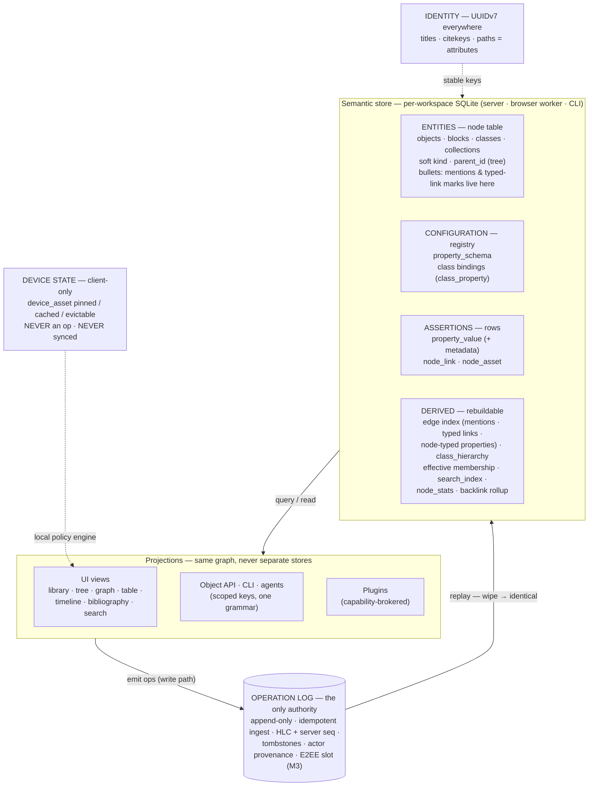

# Notees Knowledge Model

> The definitive model statement for the greenfield rewrite. Companion: [model-assessment](02-model-assessment.md) (decision history + confidence ledger), `packages/protocol/SCHEMA.md` (property-schema, class-structure, and typed-link token spec). Diagram: [knowledge-model-diagram](knowledge-model-diagram.png).

## 1. The model in one sentence

> **One node table for every entity; attributes in properties; discourse in the content; one derived index behind every view; the operation log is the only authority; every usage prediction is a default, never a prohibition.**

## 2. Layer diagram

## 3. The five storage categories

| Category | Members | Rule |
|---|---|---|
| **ENTITIES** — single `node` table | objects, blocks, classes, collections, asset metadata | UUIDv7 identity; addressable, linkable, annotatable, provenance |
| **CONFIGURATION** — registry | `property_schema`, class bindings (`class_property`) | typed rows, UUID-keyed, user-definable, deprecatable (`active`), description column |
| **ASSERTIONS** — rows, never nodes | `property_value` (+ `metadata` JSON), `node_link`, `node_asset` | facts *about* entities; typed, LWW, tombstoned |
| **DERIVED** — rebuildable projections | `edge` index (mentions + typed links + node-typed properties), `class_hierarchy` (transitive `extends` closure), effective-membership read model, bindings read model, `search_index`, `node_stats`, backlink rollup | applier-maintained; wipe → replay → identical |
| **INFRA** — never ops | `sync_*`, `crdt_state`, `device_asset`, snapshots | client-local; semantic state only in the log |

**The entity line:** a thing is a node iff its lifecycle happens in the user's mind. Classes pass; property schemas fail (`isbn` is vocabulary for forms and the compiler — addressable and user-definable, not graph citizens). **Meta-layer test:** if uniformizing X requires a parallel attribute system for it, X is configuration, not an entity.

## 4. The three orthogonal axes

- **Class** (`class_ids`) — *what it is*.
- **Hierarchy** (`parent_id`) — *where it lives* (a tree: single field, TreeCrdt ordering).
- **Kind** (`kind: page|block`) — *how prominent* (soft, LWW, one op to flip). `page` is a query over content nodes: `kind='page' OR parent_id IS NULL`.

Promotion/demotion = flip `kind` (± a move); identity preserved. "Drop the kind doctrine" = drop the hard semantics (the v1 `CHECK`), keep the soft column.

**Topology note:** nodes form a tree (scalar parent); classes form a DAG (`extends` is transitive and many-to-many — which is exactly why `extends` is an *m2m property* and `parent_id` is a *field*).

## 5. Blocks are nodes — the outliner model

**The editor is Logseq-style: bullet points, and each bullet is a block is a node.** Indent/outdent reparents (`node.move` + TreeCrdt); reordering changes sibling order (fractional position strings + TreeCrdt — v1's proven machinery, ported). Long-form writing emerges from nesting bullets, not from a separate document mode; a page's content is its bullet tree.

All authoring happens in blocks: prose, facts-as-blocks, discourse moves, inline links. Display defaults keep blocks quiet: backlinks aggregate mentions per parent, graph collapses children, search ranks roots first with block hits nested under parents, queries default to root scope. *First-class storage, second-class display.*

## 6. Classes are nodes

A class **is** a node and is **for** configuration. The v1 split (separate `class` table) was reverted after five rationales — three gestural ones expired, inheritance semantics belong to the derived layer, column economics was never worth its cost ([model-assessment](02-model-assessment.md) §5).

**Settled design:**
- **Structure is data, not tables:** `extends` is an **m2m node-typed property** on class nodes (target filter: class nodes) — multiple inheritance from the start, no special rule. `has-property` bindings are registry rows. `has-template` is a node-typed property on class nodes pointing at ordinary template nodes (instantiation clones content + children at apply time; references are linked, never duplicated). Elaborated design brief + open decision points: `../implementation-plan.md` §34.25 (2026-10-02, Capacities comparison); owner confirmation of D1-D4 there pending. The applier derives the `class_hierarchy` closure from `extends` values; the QueryAST compiler reads derived tables only.
- **Inheritance behavior is v1's:** a `project` node where `project extends task` appears in both class lists and inherits task's property bindings. Effective membership = own classes ∪ ancestors. **Binding resolution:** own binding wins → shortest extends-path depth → earliest-authored `extends` value (lowest HLC). Diamonds natural; cycles rejected fail-loud.
- **Tree-external:** class nodes never use `parent_id`; `node.move` rejects a class as parent or child (fail-loud); content projections (recents, tree, link dropdown, graph) exclude class nodes by default — a projection default, not a schema restriction.
- **Content shelf = description only** (documentation *of the config*). Content *about* instances lives in topic pages — **the Meetings pattern**: a "Meetings" page carries prose and embeds a query over nodes classed `meeting`; the class page's default view = configuration + members query; "New class" may generate the companion topic page.
- **Deletion of a class with live instances:** instances keep their `class_ids` entry, rendered raw; never cascade. System classes protected by validation on seeded UUIDs. `node_alias` survives for true synonyms only.

## 7. Configuration registry

`property_schema` rows: `value_type` (incl. node-typed m2o/m2m), `options`, `validation`, `target_class_filter`, `default`, `active`, `description`. UUID-keyed, user-definable at runtime, deprecatable never deleted while referenced. Class bindings (`class_property`: seq, required, readonly, hide_when_empty) are registry rows maintained by ops. Pressure valve if the registry ever feels tight: a `doc_node_id` pointing at an optional documentation node.

## 8. Three information layers, one index — and the tree propagates links

| Layer | What | Where it lives | Surfaced as |
|---|---|---|---|
| **Attributes** | authors, publication date, location | `property_value` rows (node-typed values = Odoo-style m2o/m2m; per-value `metadata` JSON for qualifiers like `since`) | property panel, table columns, QueryAST `prop:` conditions |
| **Discourse connections** | "X **contradicts** Y" — typed links | **content marks on prose words** (verb + optional target + token metadata such as a locator); verb = property-schema ref *or free string* | colored underlines, backlinks grouped by verb, graph edge types |
| **Plain prose** | everything else, incl. facts-as-blocks and untyped links ("Located in <<Paris>>") | content AST; `node_link` pills | backlinks, search, graph |

All three layers feed the **same derived `edge` index** — mentions, typed links, and node-typed property values project to edges — so backlinks, graph, and queries see the graph uniformly regardless of how it was authored. **No layer is load-bearing for the others.**

**Link propagation along the tree (both directions):**
- **Roll-up (backlinks):** a block mentioning <<Paris>> — child of the "France" page — appears in the backlinks of **both** Paris and France. Mentions of a node surface in the backlinks of its ancestors.
- **Flow-down (filter inheritance):** a node matches `linked-to:X` when X ∈ its **reference set**, defined recursively: `refset(n) = own_links(n) ∪ refset(parent(n))` — transitive by construction. Concretely: (a) **containment in a page counts** — anything inside page P references P ("inside page P itself"); (b) **a block passes its links down** — anything nested under a block that links P references P, at any depth. The trigger is the *link on the block*, not page location per se. *Example:* a bullet linking ACME, with a nested child bullet linking Jane — `linked-to:ACME AND linked-to:Jane` returns the child, no explicit tagging. Inheritance governs **filtering, not membership**: backlinks list actual links — but the backlinks view can be narrowed with facets over inherited links (Logseq-style), e.g. Jane's backlinks filtered to `refset ∋ ACME` shows only Jane-mentions made in the context of ACME, even when the ACME link lives on a parent block. Derived edges store distance so deep-nesting dilution is a ranking matter, not a semantics matter.

Semantics fixed; fan-out at projection vs. traversal at query time is an implementation choice. *(Open question, deferred: should classes also propagate down the tree for filtering? Not decided.)*

## 9. Typed links — UX contract

- A typed link is a **mark on a prose word** — you write the sentence naturally ("argument X *contradicts* argument Y in <<Book Z>>"); optionally elevate the word: select it (or type it via `@`, which inserts plain text wrapped in the mark) and bind a verb. **Nothing is inserted; the word you wrote is the annotation** — no phrase-flow break, no duplicated information. Rendering: subtle colored underline, hover card, and a global "show types" overlay toggle (off by default in reading mode).
- **Lifecycle is honest:** delete the word, the annotation dies with it — the graph stops claiming what the sentence no longer claims. Marks ride inside the CRDT-synchronized AST text, so collaborative edits can't orphan them.
- **Verb vocabulary:** bound property schemas offered where applicable (with **create-and-bind** when the verb doesn't exist yet — schema-at-capture, or the feature dies in setup); bare free strings always allowed; backlinks group by the verb string.
- **Target binding: DEFERRED.** How a verb mark resolves its target mention(s) is a semantic design question that depends on real usage consistency — no rule is specced now; to be designed with usage data (see SCHEMA.md open questions). The mark records the verb; target resolution lands later without protocol breakage.
- **Adorned-pill mode survives only as the escape hatch** for when there is no natural verb ("see <<Y>>").
- **Citations are the canonical dogfood (M2):** `cites` verb + locator as token metadata; locator auto-filled from the current PDF selection.

## 10. Properties are optional — a binding constraint

Some users will never use properties; they type facts as child blocks. **Core flows must not depend on properties:** search, backlinks, class membership, class pages, containment rollup, and queries over content all work from content + classes alone. Properties buy table columns and structured views — nothing more, and that's by design. Between prose and structure: a **promotion gesture** ("turn this line into a `location` property"), lint *suggestions*, never automatic inference. Optional reverse: render a property value inline as a block, opt-in.

**Property vs. typed-link guidance** (the owner's distinction, formalized): **property** when the association is an *attribute of the object* — browsed in panels, shown in tables, edited as data (authors); **typed link** when it's a *move in discourse* — it reads as a verb in a sentence (contradicts).

## 11. Where knowledge lives

| Kind | Home |
|---|---|
| Claim/fact ("deliberate practice needs immediate feedback") | object, class `claim`; content = the claim in your words |
| Provenance | `cites` typed link with locator, or a node-typed property — author's choice; conventions recommend the typed link in prose |
| Epistemic wiring | typed-link verbs: `supports` / `contradicts` / `refines` (free strings or bound schemas) |
| Question ("does feedback need to be immediate?") | object, class `question` |
| Open questions | collection = query: `class:question` minus those with an `answers` verb in attached prose |
| Fleeting → permanent | `maturity` property or a class move + Inbox collection; **never** schema kinds |
| Essays/synthesis | ordinary objects; connect claims via typed links or plain mentions |

The Zettelkasten/evergreen discipline is **convention enabled by the model, never enforced** — and the epistemic vocabulary is **documented convention, not protocol seeds**: starter property schemas users may create, not predefined types shipped in the picker.

**System seeds (stable UUIDs):** classes — `tag`, `claim`, `question`, `meeting`, `collection`, `query`, entity classes (`person`, `organization`, `project`, `source` tree, `asset`, `annotation` family…); system property schemas bound to system classes (authors, publication_date, citekey…) as in v1. No seeded relation vocabulary — there are no relation entities.

## 12. Identity, provenance, deletion, conflict

- **UUIDv7 is the only identity.** Titles, citekeys, filenames, paths are attributes.
- **Every mutation is an op** (actor, HLC, seq); the log is the audit trail *and* the schema history.
- **Deletion is a tombstone / soft-delete + retention** (nodes → trash; property values → tombstone rows; content marks die with their content ops). Convergence: **LWW by HLC** for scalars and property values; **OR-Set add-wins** for class membership and m2m values; **Yjs CRDT only** for collaborative text/tree. No CRDT-everywhere.
- **Semantic state only in the log.** Device state (`device_asset`, UI layout) is client-local, never an op; cross-device preferences ride user settings.

## 13. The design law

> **Encode usage predictions as defaults, linter rules, and generated views — never as schema prohibitions.**
> A wrong prediction under permissive storage costs an empty list; under a prohibition it costs a parallel mechanism, a migration, or an identity break.
> **Corollary (meta-layer test):** if uniformizing X requires a parallel attribute system, X is configuration, not an entity.

v1's cautionary prohibitions — the `kind` CHECK, set-only classes, content-less classes — were reasonable forecasts hardened into structure; each expired. The seeded-epistemic-vocabulary proposal was the same pattern about to repeat at the protocol layer; caught and demoted to convention.

## 14. Workflow examples

### W1 — From BibTeX to a cited sentence

`notees import --format bibtex kuhn.bib` → creates the `paper` object (properties: title, doi, publication_date, citekey) and `person` objects (find-or-create), wired by an `authors` m2m node-typed property. Reading: highlight p.42 → `annotation` object (target asset, page, quote as properties). Writing: "Kuhn *cites* …" — the word marked, locator auto-filled from the PDF selection. Search "paradigm" hits title, prose, properties, and the annotation's quote. Export `--format bibtex` projects from attributes. "Where is this source used?" — backlinks, with roll-up through containment ancestors.

### W2 — Offline annotation on the phone

Pinned PDFs (`device_asset`, device-local). Offline annotations accumulate as ops in the outbox; derived store updates immediately. Online: idempotent push + seq catch-up; concurrent edits merge by LWW; deletes win by tombstone and surface in the conflict UI.

### W3 — A meeting earns its entity

A `meeting`-classed bullet in the daily note (a block, quiet by default). Months later it matters: promote — flip `kind` to `page`, optionally nest under the company page. Same node, same id, all links intact; recents and dropdown ranking pick it up automatically.

### W4 — "Located in <<Paris>>" + filtering by inherited links

A bullet in a travel note links Paris (child of the "France" page): it appears in the backlinks of **both** Paris and France. Separately, someone writes a bullet linking Jane directly inside the ACME project page: containment in a page counts as referencing it, so `linked-to:ACME AND linked-to:Jane` returns that bullet. And if instead the Jane bullet were nested under *any* bullet that links ACME — in any note — the same query finds it, at any depth; no one tagged anything.

## 15. Paradigm position

| Dimension | Notees v2 | Obsidian | Logseq (DB) | Roam | Capacities |
|---|---|---|---|---|---|
| Unit | typed object | Markdown file | outline block | block | typed object |
| Identity | UUIDv7 | file path | block UUID | block UID | server-side id |
| Editor | **outliner (Logseq-style bullets)** | document | outliner | outliner | document-ish |
| Linking | mentions + **typed verb marks** + node-typed properties (m2o/m2m) | `[[wiki]]` | block/page refs | block refs | typed object links |
| Typing | **user-defined classes + property schemas as runtime data** | none native | classes + properties | none | curated type catalog |
| Query | QueryAST→SQLite, one grammar | Dataview | Datalog heritage | Datalog | filtered views |
| Local-first | op log, total offline, E2EE slot | files + file sync | files + sync | cloud-first | cloud sync |
| Agent surface | **first-class API + CLI + scoped keys** | none native | limited | graph API | limited |

## 16. Milestone tiers

- **M1 — the core is the product:** unified node model (soft `kind`, tree-external classes); `extends` as m2m property + derived closure + effective membership; property registry + m2o/m2m node-typed values with `metadata` column; **Logseq-style outliner editor** (bullets, indent/outdent reparenting via TreeCrdt, reorder via fractional positions, pills, verb marks); edge index with backlink roll-up + filter inheritance; unified FTS; object API + CLI. *No new sync primitive — M1 adds columns, tokens, and an editor.*
- **M2 — research environment:** typed-link target resolution (designed with usage data), citations pipeline (verb marks + locators + CSL-JSON/BibTeX/RIS round-trip), annotations on assets, selective asset sync, property-schema CRUD UX + promotion gestures, full editor polish.
- **M3 — trust & extension:** E2EE activation, plugin runtime (capability broker, subprocess), event projections + webhooks, multi-user hardening.

## 17. Confidence

See [model-assessment](02-model-assessment.md) §9. Sync core and storage categories: high. Class-as-node, outliner editor, link propagation, and scale (S2 spike): medium behind specs/spikes. Nothing uncertain is load-bearing for sync. The most load-bearing untested surfaces are typed-link capture friction (mitigated by create-and-bind) and the outliner's long-form writing feel (the deliberate bet against document-mode editors).
